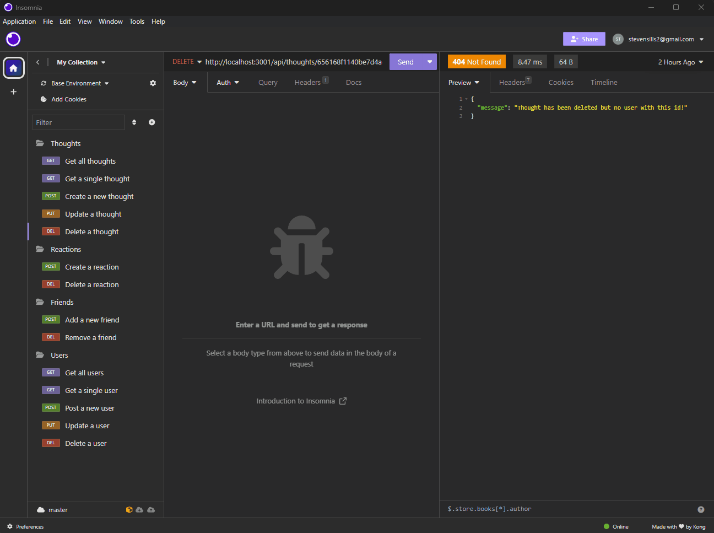

# 🕸️ Social-Network API - Backend using a MongoDB 🏗️

## Technology Used 👷‍♂️

 <p float="left">


</p>

## Description 📝

[Watch a video of all the routes in action](https://apixa25.github.io/weather-dashboard/) 👀

This project is an API for a social network web application.  This project uses Node.js to work with the back end (the server stuff). It uses Express to configure the API routes.  Moment to display dates and times. And Mongoose to model the application data.


The routes model is interesting in that it has Users, who can have Thoughts and then users can have Reactions to those thoughts. A user can have many thoughts.  But a thought can only have one user. A user can have many reactions to many thoughts.   

## Table of Contents 📑

* [Usage](#usage)
* [Learning Points](#learning-points)
* [Author Info](#author-info)
* [License](#license)

## Usage ⏯️
  1. Fork and clone repository to local machine. 
  2. Open integrated terminal in personal IDE.
  3. Run ```npm i``` to install dependencies in local project directory. 
  4. Run ```npm run start``` to start server on local port. 
  5. Test endpoints in API tester such as [Insomnia](https://insomnia.rest/).



## Learning Points 🧑‍🏫

This project highlights a couple of things.  One is the difference between ORM ( which are often examples of SQL databases) and an ODM which are called No SQL database ( which in this case is a Mongo database). 

ORM (Object-Relational Mapping): It is a programming technique that converts data between incompatible type systems in object-oriented programming languages. In the context of databases, it often refers to mapping database tables to classes in an object-oriented language. The purpose is to simplify database interactions by allowing developers to work with objects in their programming language, rather than writing raw SQL queries. 

ODM (Object-Document Mapping): This term is specifically used in the context of NoSQL databases, especially for document-oriented databases like MongoDB. ODM is similar to ORM but is tailored to work with document databases where data is stored in a flexible, JSON-like format known as documents. An ODM library allows developers to interact with the database using objects in their programming language, providing a more natural way to handle documents in a NoSQL database.

## Author Info 🙋‍♂️
### Steven Sills II
Thanks for taking a look at this project! If you would like to see more of my work or contact me please use the links below. 

<a href="mailto: stevensills2@gmail.com" target="_blank"></a>
<a href="https://www.linkedin.com/in/steven-sills-ii-90781b53/" target="_blank"></a>
<a href="https://apixa25.github.io/steven-sills-portfolio/" target="_blank"></a>

## License

[](https://opensource.org/licenses/MIT)
MIT License

Copyright (c) 2023 Steven Sills II

Permission is hereby granted, free of charge, to any person obtaining a copy
of this software and associated documentation files (the "Software"), to deal
in the Software without restriction, including without limitation the rights
to use, copy, modify, merge, publish, distribute, sublicense, and/or sell
copies of the Software, and to permit persons to whom the Software is
furnished to do so, subject to the following conditions:

The above copyright notice and this permission notice shall be included in all
copies or substantial portions of the Software.

THE SOFTWARE IS PROVIDED "AS IS", WITHOUT WARRANTY OF ANY KIND, EXPRESS OR
IMPLIED, INCLUDING BUT NOT LIMITED TO THE WARRANTIES OF MERCHANTABILITY,
FITNESS FOR A PARTICULAR PURPOSE AND NONINFRINGEMENT. IN NO EVENT SHALL THE
AUTHORS OR COPYRIGHT HOLDERS BE LIABLE FOR ANY CLAIM, DAMAGES OR OTHER
LIABILITY, WHETHER IN AN ACTION OF CONTRACT, TORT OR OTHERWISE, ARISING FROM,
OUT OF OR IN CONNECTION WITH THE SOFTWARE OR THE USE OR OTHER DEALINGS IN THE
SOFTWARE.